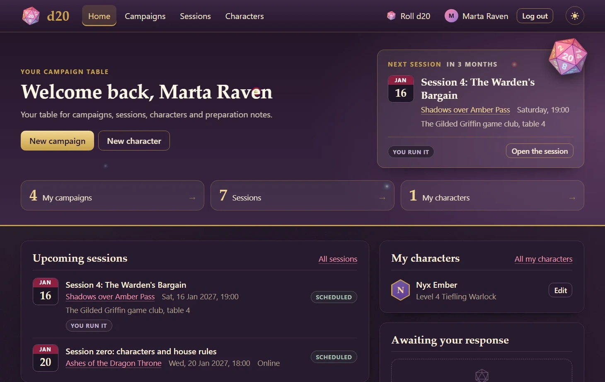

# d20

A campaign table for tabletop role-playing groups. The game master runs
campaigns and plans game sessions; the players keep their character sheets,
answer the invitations and share notes with the table.



The site is live at https://d20-f3y6.onrender.com/. The server is free and
falls asleep without visitors, so the first page can take about a minute.

Log in as `demo` with the password `roll-for-initiative` to look around; the
other accounts are in [Demo data](#demo-data).

## Features

- Registration, login and player profiles.
- Campaigns: run one as the game master or join it as a player with one of
  your characters.
- Game sessions: date, place, agenda and summary; every player confirms or
  declines the invitation.
- Character sheets: ability scores with modifiers, hit points, inventory and
  a d20 roller with advantage and disadvantage.
- Preparation notes (NPCs, locations, quests, items) that only the members of
  the campaign can read.
- Search and pagination in the lists, light and dark themes.

## Technologies

- Python 3.14, Django 6.1
- SQLite for development, PostgreSQL in production
- WhiteNoise for static files, Gunicorn as the WSGI server

## Running locally

```shell
git clone https://github.com/kateryna-che/d20.git
cd d20
python -m venv .venv
.venv\Scripts\activate        # source .venv/bin/activate on macOS and Linux
pip install -r requirements-dev.txt
python manage.py migrate
python manage.py createsuperuser
python manage.py runserver
```

The site opens at http://127.0.0.1:8000/. `manage.py` works with the
development settings, which need no environment variables: the database is
the `db.sqlite3` file.

The database starts empty. To see the site with ready campaigns, sessions and
characters, load the [demo data](#demo-data) instead of creating a superuser.

## Running the tests

```shell
python manage.py test
```

The tests run on a test database of their own, so the data in `db.sqlite3`
stays as it is.

### Application tests

The 25 tests are in `d20/tests/`, a module for every layer of the
application:

| Module           | What it checks                                           |
|------------------|----------------------------------------------------------|
| `test_models.py` | names and addresses of the objects, the campaigns of a   |
|                  | user, and the rules of a membership: the game master     |
|                  | cannot be a player of the campaign, the character must   |
|                  | belong to the player                                     |
| `test_forms.py`  | the registration and search forms; the membership form   |
|                  | offers a player only their own characters                |
| `test_views.py`  | the pages: login is required, registration, the numbers  |
|                  | of the home page, the list, search, creation, editing    |
|                  | and deletion of campaigns, joining and leaving one, the  |
|                  | list and creation of characters, the answer to a session |
|                  | invitation                                               |
| `test_admin.py`  | the bio of a player on the user page of the admin site   |

The tests of the views are the closest to end-to-end ones: they send requests
with the test client of Django and check the redirect, the template, the
context and the rows in the database. They guard the access rules. For
example, a game master who edits the campaign of another game master gets the
404 page, and the campaign stays the same.

Run one module or one test by its path:

```shell
python manage.py test d20.tests.test_views
python manage.py test d20.tests.test_views.PrivateCampaignTests.test_join_and_leave_campaign
```

### Coding style tests

The code is formatted with [Black](https://black.readthedocs.io/), so the
whole project has one style. `pyproject.toml` keeps the migrations out of
it. Check the style without changing the files:

```shell
black --check .
```

`black .` reformats the files.

## Demo data

The `demo` fixture, `d20/fixtures/demo.json`, fills an empty database with a
busy table: 11 players, 9 campaigns, 46 game sessions, 27 character sheets
and 32 notes.

```shell
python manage.py migrate
python manage.py loaddata demo
```

Load it instead of `createsuperuser`: the fixture brings its own accounts and
overwrites the rows that have the same primary keys. Every account has the
password `roll-for-initiative`.

| Login        | What it shows                                                |
|--------------|--------------------------------------------------------------|
| `demo`       | the main account: runs three campaigns, plays in three more, |
|              | has ten characters and sessions that wait for an answer      |
| `lena`       | the game master of a campaign where `demo` is a player       |
| `tess`       | a player of "Skyship Smugglers", which `demo` sees from the  |
|              | outside: no notes, only the button to join                   |
| `dicegoblin` | a player without a name, a bio or a character                |
| `robin`      | a new account: every list is empty                           |
| `admin`      | the superuser of the admin site at `/admin/`                 |

The other players are `marco`, `oleh`, `priya`, `sam` and `yuki`.

The dates of the fixture are fixed: the scheduled sessions run from October
2026 to April 2027.

The production database takes the same fixture. The command needs the
environment variables of the [production settings](#settings):

```shell
python manage.py loaddata demo --settings=d20_dev.settings.prod
```

On a public server change the password of `admin` right after that:

```shell
python manage.py changepassword admin --settings=d20_dev.settings.prod
```

The fixture is the output of `dumpdata` and is written again the same way
when the models change:

```shell
python manage.py dumpdata d20 --indent 2 --output d20/fixtures/demo.json
```

On Windows `dumpdata --output` writes the file in the encoding of the system
locale, so the texts of the fixture are plain ASCII. Set `PYTHONUTF8=1` before
other characters go into it.

## Settings

The settings are a package with a module for every environment:

| Module                  | Used by                 | Database   |
|-------------------------|-------------------------|------------|
| `d20_dev.settings.dev`  | `manage.py` by default  | SQLite     |
| `d20_dev.settings.prod` | `wsgi.py` and `asgi.py` | PostgreSQL |

Another module is chosen with the `DJANGO_SETTINGS_MODULE` environment
variable or with the `--settings` option of `manage.py`:

```shell
python manage.py migrate --settings=d20_dev.settings.prod
```

The production settings read the variables below from the environment. For
local use copy `.env.sample` to `.env` and fill it in; the file is loaded
when the settings are imported.

| Variable            | Value                                       |
|---------------------|---------------------------------------------|
| `POSTGRES_DB`       | name of the database                        |
| `POSTGRES_DB_PORT`  | port of the database server, usually `5432` |
| `POSTGRES_USER`     | database user                               |
| `POSTGRES_PASSWORD` | password of the user                        |
| `POSTGRES_HOST`     | host of the database server                 |
| `DJANGO_SECRET_KEY` | long random string                          |

## Deployment

The project is ready for a [Render](https://render.com/) web service with a
PostgreSQL database, for example on [Neon](https://neon.tech/):

- build command: `./build.sh`, which installs the requirements, collects the
  static files and applies the migrations;
- start command:
  `gunicorn d20_dev.wsgi:application --workers 1 --threads 10`;
- environment variables: the ones from the table above.

Render sets `RENDER_EXTERNAL_HOSTNAME` itself, and the production settings
add this domain to `ALLOWED_HOSTS`.

The build does not load the [demo data](#demo-data): the fixture is loaded
once by hand.
